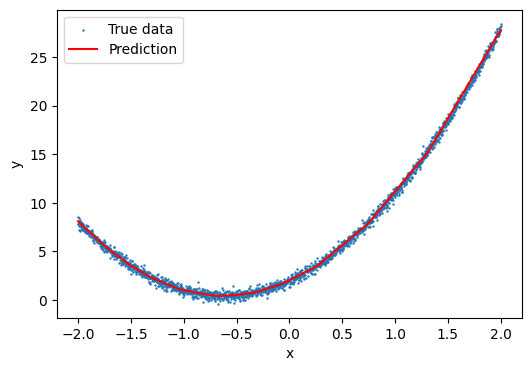

Tutorial 6: Introduction to Pytorch Lightning
=============================================

PyTorch Lightning
-----------------

**PyTorch Lightning** is a library that builds on top of PyTorch by providing a high-level interface for the deep learning framework. 
It is designed to help machine learning researchers and developers streamline their experiments and increase the readability and reproducibility of their code by reducing boilerplate.

PyTorch Lightning converts standard PyTorch code into structured, organized scripts that separate the science code from the engineering. 
It is built for professional researchers and engineers who need a scalable and maintainable framework without sacrificing the flexibility and power of PyTorch.

Some core benefits of PyTorch Lightning include:

#. **Focus on the Research**: By abstracting the training loop and other boilerplate code, researchers can focus solely on the model architecture and the experiment itself.

#. **Readability**: Code is cleaner and easier to understand, maintain, or share with others.

#. **Modularity**: Components such as models, optimizers, and data are separate and interchangeable, allowing for easy adjustments and extensions.

#. **Scalability**: Supports seamless transitions between different computing environments like CPUs, GPUs, and TPUs without changing the code.

#. **Reproducibility**: By enforcing structuring of the code, it becomes easier to reproduce experiments and results which is crucial for scientific validations.

Example of Building a Simple Model in PyTorch Lightning
-------------------------------------------------------

The following example demonstrates how to "learn" a non-linear relationship using PyTorch Lightning.

.. code-block:: python

    import torch
    from torch import nn
    from lightning import pytorch as pl
    from torch.utils.data import DataLoader, Dataset, random_split
    import numpy as np

Here we generate a dataset with a quadratic relationship between y and x, and define a model with three linear layers and ReLU activation functions.

.. code-block:: python

    # Define a simple dataset
    class SimpleDataset(Dataset):
        def __init__(self, num_samples=2000):
            self.x = np.linspace(-2, 2, num_samples)
            self.y = 4 * self.x**2 + 5 * self.x + 2 + 0.3 * np.random.randn(num_samples)
            self.x = self.x.astype(np.float32).reshape(-1, 1)
            self.y = self.y.astype(np.float32).reshape(-1, 1)

        def __len__(self):
            return len(self.x)

        def __getitem__(self, idx):
            return self.x[idx], self.y[idx]

    # Define the model
    class SimpleModel(pl.LightningModule):
        def __init__(self):
            super(SimpleModel, self).__init__()
            self.layer_1 = nn.Linear(1, 15)
            self.layer_2 = nn.Linear(15, 15)
            self.layer_3 = nn.Linear(15, 1)
            self.relu = nn.ReLU()

        def forward(self, x):
            x = self.relu(self.layer_1(x))
            x = self.relu(self.layer_2(x))
            x = self.layer_3(x)
            return x

        def training_step(self, batch, batch_idx):
            x, y = batch
            y_hat = self.forward(x)
            loss = nn.MSELoss()(y_hat, y)
            self.log("train_loss", loss)
            return loss

        def configure_optimizers(self):
            return torch.optim.Adam(self.parameters(), lr=0.001)

Here we set up the training and validation data loaders, and train the model using the PyTorch Lightning Trainer.

.. code-block:: python

    torch.manual_seed(1)
    np.random.seed(1)

    # Prepare data
    dataset = SimpleDataset()
    train_size = int(0.8 * len(dataset))
    val_size = len(dataset) - train_size
    train_dataset, val_dataset = random_split(dataset, [train_size, val_size])

    train_loader = DataLoader(train_dataset, batch_size=32, shuffle=True)
    val_loader = DataLoader(val_dataset, batch_size=32)

    # Train the model
    model = SimpleModel()
    trainer = pl.Trainer(max_epochs=200)
    trainer.fit(model, train_loader, val_loader)

Here we test the model predictions and visualize the results.

.. code-block:: python

    # Test the model
    test_x = np.linspace(-2, 2, 100).astype(np.float32).reshape(-1, 1)
    test_x_tensor = torch.tensor(test_x)
    model.eval()
    with torch.no_grad():
        test_y_pred = model(test_x_tensor).numpy()

    # Visualize the results
    plt.figure(figsize=(6, 4))
    plt.scatter(dataset.x, dataset.y, s=0.5, label="True data")
    plt.plot(test_x, test_y_pred, color="r", label="Prediction")
    plt.xlabel("x")
    plt.ylabel("y")
    plt.legend()
    plt.show()

For a detailed documentation and advanced features of pytorch lightning, please refer to the official documentation at:
https://lightning.ai/docs/pytorch/stable/

A More In-depth Example of PyTorch Lightning
--------------------------------------------

This example demonstrates linear regression using likelihood-free inference using both `Pytorch-Lightning <https://lightning.ai/>`_ and `Pyro <https://pyro.ai/>`_. 
This example is originally written by Deep Chatterjee, adapted by Xuejian Shen.

A `jupyter notebook <https://github.com/mit-submit/submit-examples/blob/main/pytorch_lightning/linear-regression-pytorch-lightning.ipynb>`_ is provided
that walks through the bayesian inference on the slope and intercept of a line by deriving the exact answer of the posterior, 
followed by re-doing the analysis using stochastic sampling, and eventually using a normalizing flow. 

Setup the environment to run this example
.........................................

You can create a ``conda`` environment locally using the ``environment.yaml`` file with the following content:

.. code-block:: yaml

    name: iap-tutorial
    channels:
        - conda-forge
        - defaults
    dependencies:
        - c-compiler
        - ipykernel
        - typing-extensions
        - pip
        - python=3.9
        - pip:
          - https://download.pytorch.org/whl/cu116/torch-1.13.0%2Bcu116-cp39-cp39-linux_x86_64.whl#sha256=129d95249fe20ccd83d156323a5e2a6aba83e18841a00ac724e270ad806dd493
          - bilby
          - matplotlib
          - websockets
          - pydantic==1.10
          - lightning==1.8.6
          - pyro-ppl==1.8.0

And then create the environment using the following command:

.. code-block:: bash

    $ conda env create -f environment.yaml
